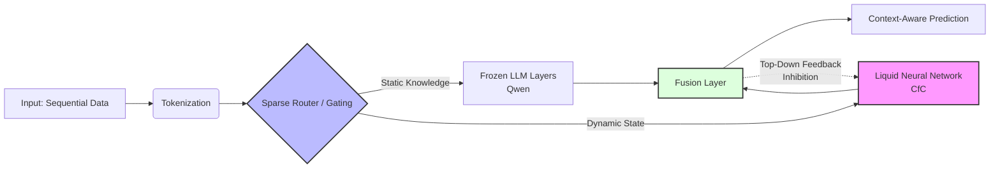

# 👋 Michaël Féré

### *Senior Data Scientist | PhD | Industrial AI*

---

## 🧐 À Propos

> *"La meilleure IA est celle qui comprend les contraintes du monde réel."*

Je suis un **Senior Data Scientist** avec **10+ ans d'expérience** dans la transformation de données physiques complexes en solutions industrielles.
Mon background de **Docteur en Chimiométrie et Traitement du Signal** (CNRS/Université de Reims) me permet de comprendre la donnée brute (bruit, dérive, physique), tandis que mes compétences en **GenAI** et mon apprentissage actif du **MLOps** me permettent de concevoir des solutions prêtes pour la production.

* 🔭 **Focus R&D :** Hybridation **LLM + Neural Liquid (CFC)** (Project EXALIA)
* 🏭 **Spécialité :** Modèles robustes pour l'IoT, l'Industrie 4.0 et la HealthTech
* 📊 **Domaines d'expertise :** Spectroscopie, Imagerie Hyperspectrale, Séries Temporelles, Computer Vision
* ⚡ **Soft Skills :** Vulgarisation scientifique, Collaboration R&D/Métier, Transfert Labo → Industrie

---

## 🧠 Project EXALIA : La "Chirurgie des LLM"

**Architecture Hybride pour l'IA Temporelle et le Raisonnement Causal**

Je développe une architecture expérimentale visant à intégrer la **dynamique continue** (Physique) au sein des **Transformers** (Langage), avec une boucle de rétroaction permettant un raisonnement multi-étapes.

**Concept :** Injection de couches **CfC** (Closed-form Continuous-time) dans un backbone **Qwen** via **Sparse Upcycling**, avec une **boucle de rétroaction Top-Down** permettant au modèle de raffiner son raisonnement.

**Objectif :** Traiter la séquentialité logique textuelle et la causalité comme une dynamique temporelle continue, permettant un raisonnement multi-étapes (Mode "Reasoning Loop").

**Innovation clé :** La boucle de feedback (Fusion → CfC) active un mode de raisonnement itératif, où le modèle peut inhiber ou renforcer certaines voies neuronales selon le contexte global.

**Stack :** PyTorch, Hugging Face, torchdiffeq, Neural Circuit Policies.

---

## 🛠️ Arsenal Technique

<table align="center">
  <tr>
    <td align="center" width="90"><strong>Core AI</strong></td>
    <td align="center">
      
      
      
      
      
      
    </td>
  </tr>
  <tr>
    <td align="center" width="90"><strong>GenAI</strong></td>
    <td align="center">
      
      
      
      
      
      
    </td>
  </tr>
  <tr>
    <td align="center" width="90"><strong>MLOps</strong></td>
    <td align="center">
      
      
      
      
      
    </td>
  </tr>
  <tr>
    <td align="center" width="90"><strong>Cloud</strong></td>
    <td align="center">
      
      
      
      
    </td>
  </tr>
  <tr>
    <td align="center" width="90"><strong>Languages</strong></td>
    <td align="center">
      
      
      
      
    </td>
  </tr>
  <tr>
    <td align="center" width="90"><strong>Data Viz</strong></td>
    <td align="center">
      
      
      
      
    </td>
  </tr>
</table>

---

## 🏭 Expériences Clés

### 🚀 **Industrial AI & Edge Computing** | SP3H
**2021 - Présent** • Deeptech • Aix-en-Provence

Conception de l'intelligence embarquée des capteurs **FluidBOX**.

**Challenge :** Modèles ML dérivant à cause des variations thermiques (-10°C à +60°C) et conditions industrielles réelles.

**Solutions développées :**
- ⚙️ Conception et optimisation de **modèles ML** pour identification de biocarburants renouvelables
- 🛡️ Algorithmes de **correction de baseline adaptatifs** et modèles de régression robustes (MATLAB/Python)
- 📊 Développement de pipelines de **preprocessing** pour données haute dimension

**Impact :** Déploiement industriel en raffinerie, réduction drastique de l'empreinte carbone via optimisation temps réel.

---

### 🦆 **Computer Vision & AgriTech** | CEA Tech
**2019 - 2020** • R&D Transfer • Bordeaux

**Mission :** Sexage in-ovo non invasif par Imagerie Hyperspectrale.

**Approche :**
- 📸 Fusion de **Machine Learning** et **Imagerie Hyperspectrale** (analyse spectrale + spatiale)
- 🧊 Traitement de **Data Cubes** haute dimension pour extraction d'information pertinente
- 🎯 Conception d'algorithmes de classification sur données complexes et bruitées

**Résultat :** Preuve de concept validée, contribution à une solution éthique alternative au broyage.

---

### 🔬 **AI for Healthcare** | CNRS / Université de Reims
**2012 - 2018** • PhD & Research Engineer

#### 🩸 **PhD : Diagnostic Automatisé de la Leucémie Lymphoïde Chronique (2014-2018)**

**Solution développée :**
- 🤖 Développement d'un **outil autonome de diagnostic** par Spectroscopie Raman multimodale (Projet M3S)
- 📐 Stratégie de **Double Validation Croisée Répétée** (100 modèles) pour éviter l'overfitting
- 🗳️ Algorithme de décision par **vote majoritaire** pour automatiser le diagnostic par patient

**Résultats :** 82% de précision (B sain vs B LLC), Thèse soutenue avec succès.

---

#### 🫘 **Ingénieur de Recherche : Quantification de la Fibrose Rénale (2012-2014)**

**Solution développée :**
- 🔬 Méthode **automatisée de quantification** par Spectroscopie Infrarouge (FT-IR)
- 🧬 Modèles prédictifs croisant **données spectroscopiques et cliniques** (166 biopsies)

**Impact :** Corrélation significative avec la fonction rénale (r = -0.316, p < 0.01), **Brevet FR déposé**.

---

## 📚 Publications Scientifiques & Brevets

**1. "Renal graft fibrosis and inflammation quantification by an automated Fourier–transform infrared imaging technique"**  
*Analytical Chemistry (Q1)*

**2. "Raman-based detection of hydroxyethyl starch in kidney allograft biopsies"**  
*Journal of Biophotonics*

**3. "Développement d'un microscope multimodal Raman pour le diagnostic automatique de la leucémie"**  
*Publications PhD*

**4. "Quantification de la fibrose tissulaire par spectroscopie infrarouge"**

**🏆 Brevet FR :** Méthode de quantification de la fibrose rénale par FT-IR

---

## 🎓 Certifications & Formation Continue

### **🌟 Spécialisations Complètes**
- 🏆 **IBM Data Science Specialization** — IBM (Janvier 2025)
- 🏆 **IBM Generative AI Engineering** — IBM (2024)

---

### **🤖 Generative AI & Large Language Models**

**2026**
- Generative AI: Elevate your Software Development Career (IBM)

**2025**
- Développer des applications d'IA avec Python et Flask
- Construire des applications génératives avec Python
- Apprentissage profond et réseaux neuronaux avec Keras
- Fine-tuning de Transformers
- Agents IA avec RAG et LangChain

**2024**
- Advanced Fine-Tuning for LLMs
- Gen AI Foundational Models
- Generative AI Architecture
- Prompt Engineering Basics
- Building AI Chatbots

---

### **📊 Data Science & Engineering**

**Machine Learning**
- ML with Python
- TensorFlow with Amazon SageMaker (Coursera)
- Nvidia Deep Learning Institute (2017)

**Software Engineering**
- Introduction to Software Engineering (2026)
- Software Developer Career Guide (2026)

**Data Ops**
- Applied Data Science Capstone
- Data Visualization
- SQL for Data Science
- Tools for Data Science

---

### **⚙️ Méthodologie**
- **Scrum Master Certification:** Scaling Agile and the Team-of-Teams (LearnQuest)

---

### **🎓 Formation Académique**
- 📜 **Doctorat en Traitement du Signal & Chimiométrie** — Université de Reims Champagne-Ardenne (2014-2018)
- 📜 **Master 2 Professionnel - Imagerie pour la Biologie** — Université de Rouen Normandie (2012)
- 📜 **Master 1 Recherche - Physique** — Université de Reims (2011)

---

## 🚀 Open to New Challenges

Je recherche des **missions où la rigueur scientifique rencontre l'impact business** :

- 🏭 **Industrial AI** : Modèles robustes pour l'Edge, IoT, Manufacturing, Industrie 4.0
- 🏥 **HealthTech** : Diagnostic automatisé, Medical Imaging, Precision Medicine
- 🤖 **GenAI Engineering** : Architecture LLM custom, RAG Systems, Agentic AI
- 🔬 **R&D Transfer** : Du laboratoire à la production, MLOps, Prototypage rapide

> **💡 Si vous cherchez un profil capable de passer de la physique des signaux aux architectures LLM hybrides, discutons !**

---

📍 **Aix-en-Provence, France** | 🌍 **Remote-friendly** | 🇫🇷 🇬🇧

### *"Des signaux bruts à l'impact business : je transforme des défis R&D complexes en solutions IA opérationnelles."*

